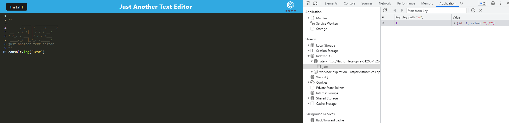

# Text Editor

## Description 
A text editor that runs in the browser. The app is a single-page application that meets the PWA criteria. Additionally, it will feature a number of data persistence techniques that serve as redundancy in case one of the options is not supported by the browser. The application will also function offline.

## Table of Contents
1. [Installation](#installation)
2. [Usage](#usage)
3. [Contributing](#contributing)
4. [Tests](#tests)
5. [License](#license)
6. [Questions](#questions)

## Installation
You can view the app [here](https://fathomless-spire-01203-452b78aee54c.herokuapp.com/).

## Usage
Open the app to add notes to the text editor.. 
  

## Contributing
N/A

## Tests
N/A

## License
Licensed under the [MIT license](https://opensource.org/license/mit/)

## Questions
You can view my GitHub repository here: [JenWariner19/text-editor](https://github.com/JenWariner19/text-editor) 
If you have any questions and would like to contact me, you can email me at: [jenniferwariner@yahoo.com](mailto:jenniferwariner@yahoo.com)
